# Ex-04-Multivariate-Analysis

# AIM:
To perform Multivariate Exploratory Data Analysis on the given data set.

# EXPLANATION:
Exploratory data analysis is used to understand the messages within a dataset. This technique involves many iterative processes to ensure that the cleaned data is further sorted to better understand the useful meaning.The primary aim with exploratory analysis is to examine the data for distribution, outliers and anomalies to direct specific testing of your hypothesis.

## ALGORITHM:


# Step 1:
Import the built libraries required to perform EDA and outlier removal.

# Step 2:
Read the given csv file and show the given data in Dataframe format.

# Step 3:
Return the objects containing counts of unique values using (value_counts()).

# Step 4:
Plot the counts in the form of Histogram or Bar Graph.

# Step 5:
Use seaborn the bar graph comparison of data can be viewed.

# Step 6:
Find the pairwise correlation of all columns in the dataframe.corr().

# Step 7:
Save the final data set into the file.

# Step 8:
End the program.

## Program:
```python
# Developed by: Shakthi kumar S
# Register Number: 212222110043

import pandas as pd 
import seaborn as sns
import numpy as np
import matplotlib.pyplot as plt
df=pd.read_csv("SuperStore_data.csv")
df

df.info()

df.describe()

df.shape

df.isnull().sum()

df['Postal Code']=df['Postal Code'].fillna(df['Postal Code']).mode()[0]
df.isnull().sum()

a=df.loc[:,["State","Sales"]]
a=a.groupby(by=["State"]).sum().sort_values(by=["Sales"])
plt.figure(figsize=(15,7))
sns.barplot(x=a.index,y='Sales',data=a)
plt.xticks(rotation=90)
plt.xlabel=("State")
plt.ylabel=("Sales")
plt.show()

a=df.loc[:,['Category','Sales']]
a=a.groupby(by=['Category']).sum()
sns.barplot(x=a.index,y='Sales',data=a)
plt.xticks(rotation=90)
plt.xlabel=('Category')
plt.ylabel=('Sales')
plt.show()

sns.barplot(x=df['Category'],y=df["Sales"],hue=df["Ship Mode"])

df.corr()
sns.heatmap(df.corr(),annot=True)

plt.figure(figsize=(10,8))
sns.scatterplot(x=df['Category'],y=df['Sales'], hue=df['Ship Mode'])
plt.xticks(rotation = 90)
```
## OUTPUT:

# Dataset:
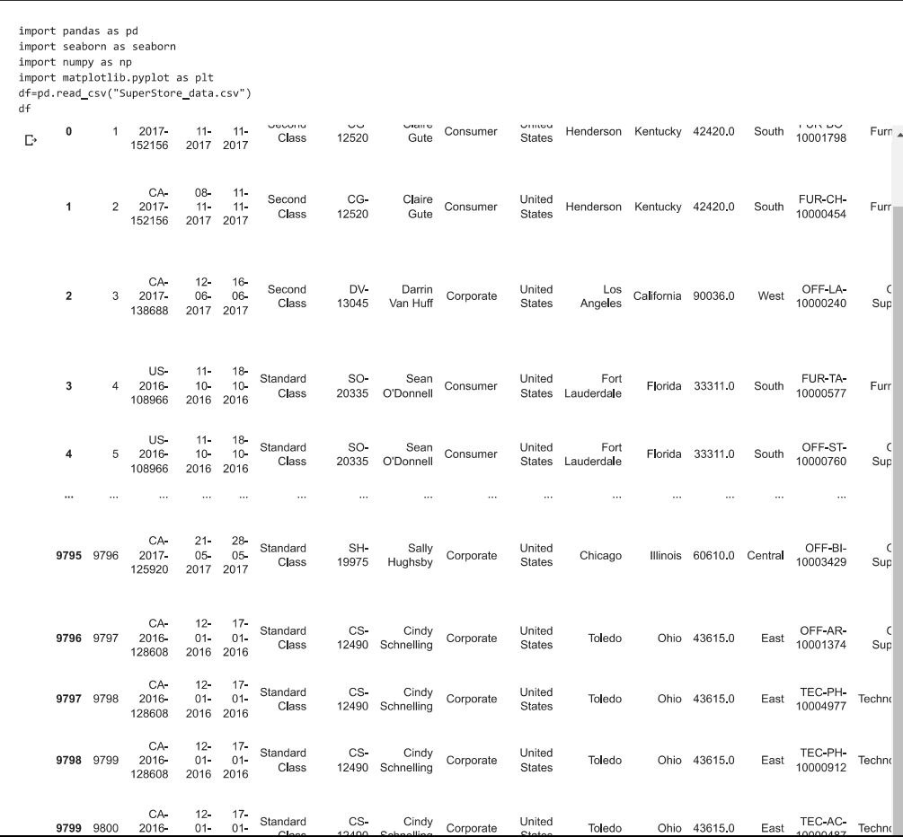

# Data info:
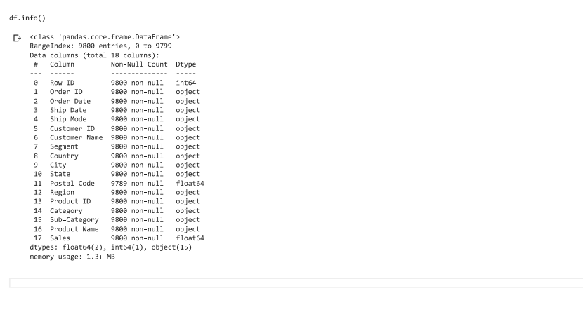

# Dataset describe:
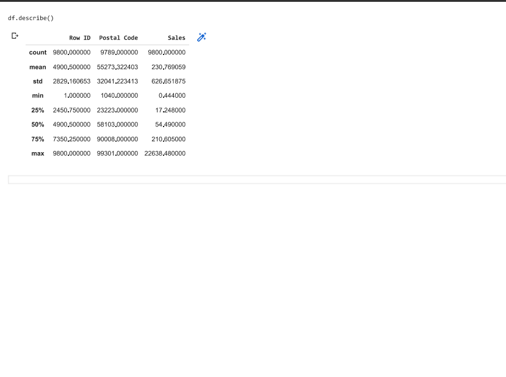

# Dataset shape:
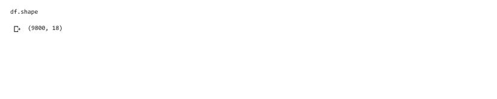

# Null Values before Cleaning:
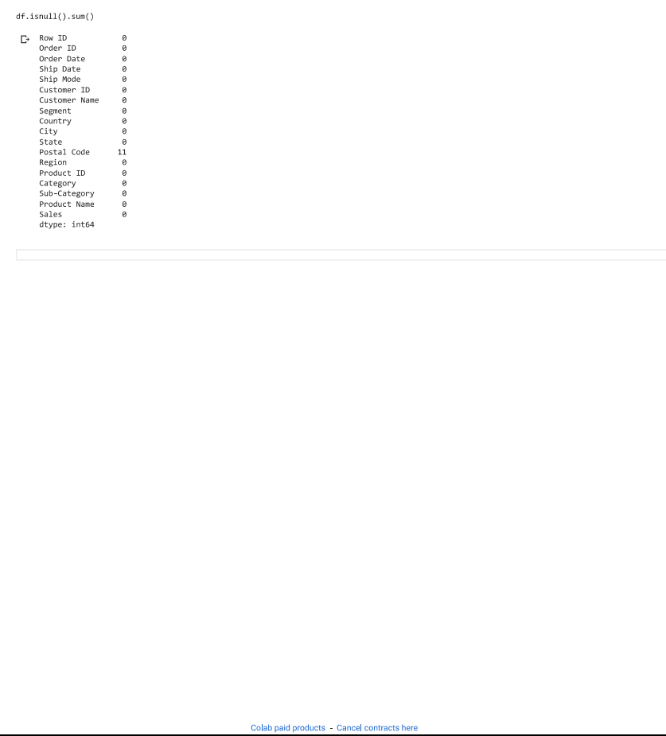

# Null Values after Cleaning:
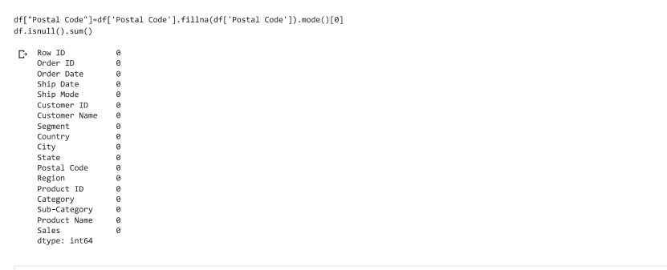

# Multivariate analysis - Barplot(State & Sales):
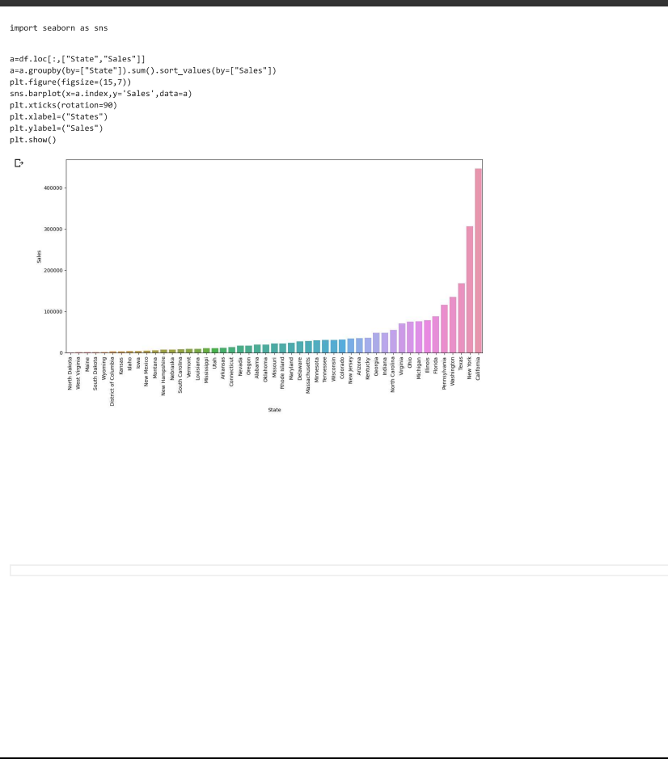

# Multivariate analysis - Barplot(Category & Sales):
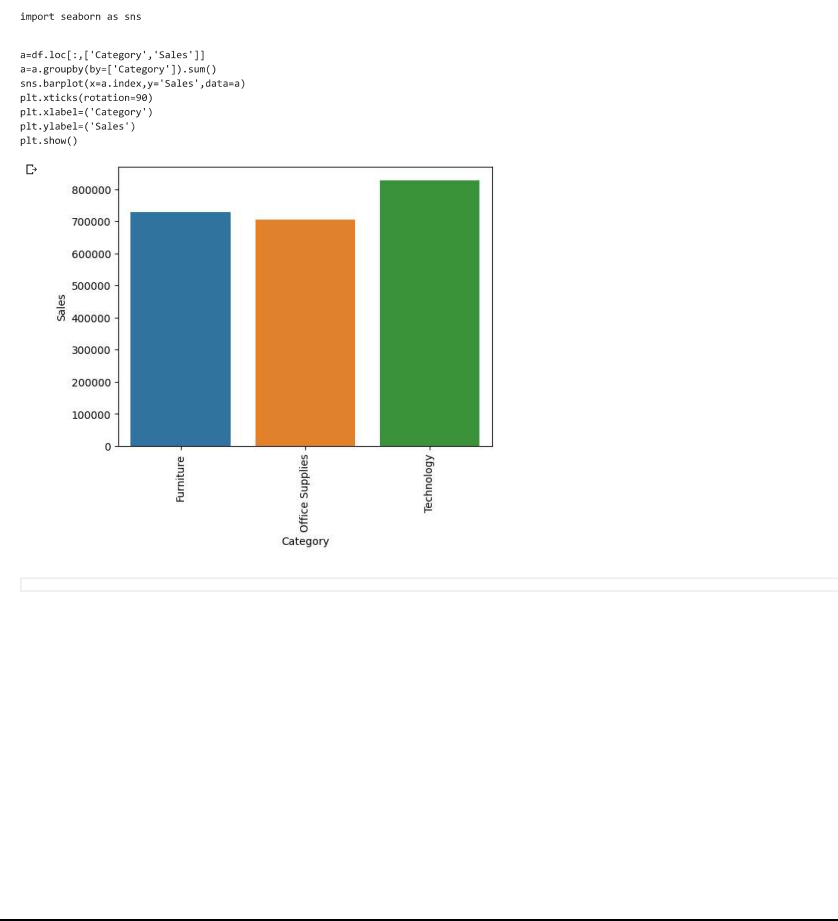

# Multivariate analysis - Barplot(Category,Sales & Ship Mode):
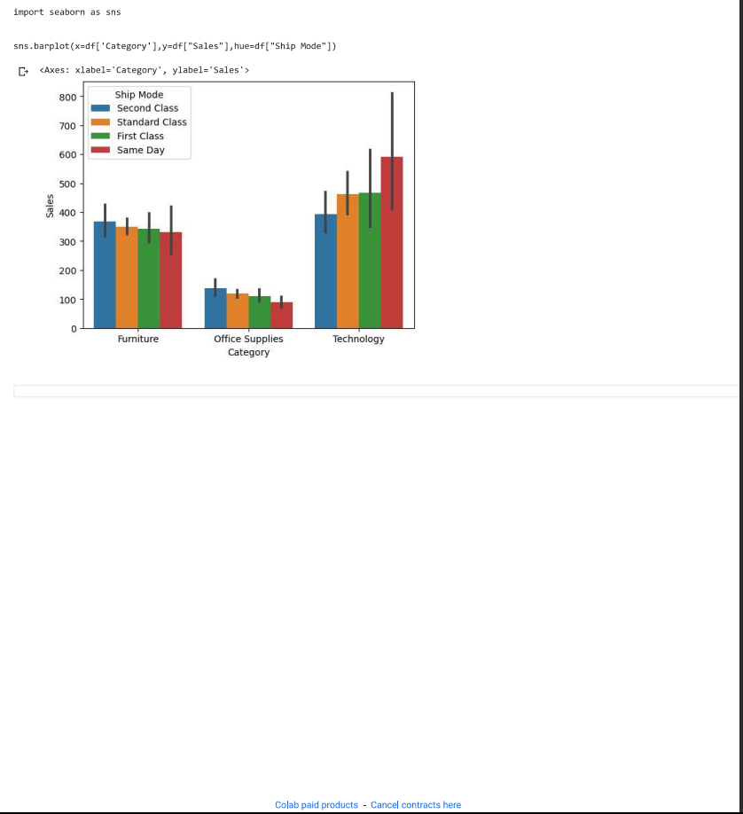

# Multivariate analysis - Heatmap
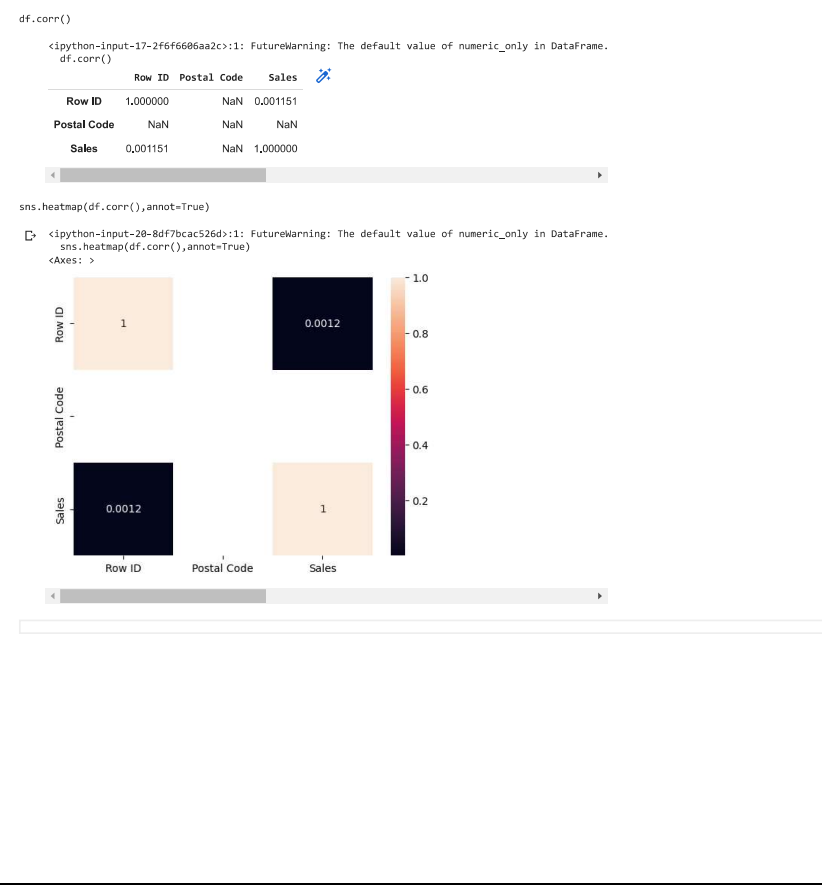

# Multivariate analysis - Scatterplot(Category,Sales & Ship Mode)
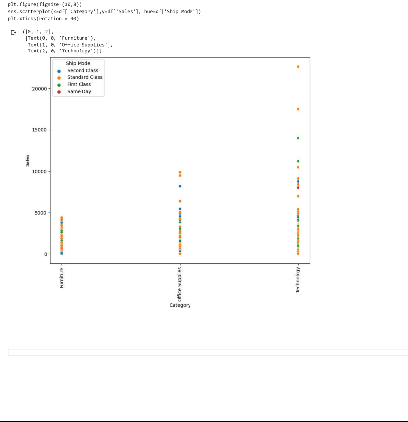

## RESULT:
The given dataset is read and Multivariate analysis is performed.
